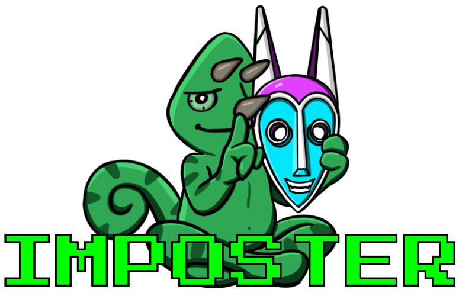

  


## 🚀 About

Failure Analysis of Deepfake Image Detection In-the-Wild downloads, pre-processes, and transforms the [SFHQ-T2I](https://www.kaggle.com/datasets/selfishgene/sfhq-t2i-synthetic-faces-from-text-2-image-models) and [TPDNE](https://www.kaggle.com/datasets/almightyj/person-face-dataset-thispersondoesnotexist) for adversarial testing using the [UniversalFakeDetect](https://github.com/WisconsinAIVision/UniversalFakeDetect) and [Simple Preserved and Augmented FEatures (SAFE)](https://github.com/Ouxiang-Li/SAFE) detection methods. Real facial imagery is pulled from the [Flickr-Faces-HQ Dataset](https://www.kaggle.com/datasets/gibi13/flickr-faces-hq-dataset-ffhq). Follow ⚙️Usage step-by-step for reproducability or implement portions as needed for your specific use case.

## ⚙️ Usage

### A. Installation

**1. Clone the Repo**  
Clone the repo using git or download and extract the zip file.
```bash
git clone https://github.com/kodamaChameleon/Imposter.git
cd Imposter
```

**2. Environment**  
Conda is the preferred environment for this project.
```bash
conda create -n Imposter python=3.13
conda activate Imposter
pip install -r requirements.txt
```

Copy .env_example to .env and update required variables.
```bash
cp .env_example .env
```

> [!NOTE]
> Additional configs may be found in utils/config.py.

### B. Data Processing

Use the standard `--help` arguement in to show available options in the CLI.

**1. Download**  
Download the required datasets.
```bash
python3 run.py --download all
```
> [!CAUTION]
> Make sure you have **plenty** of disk space before running this command. These are **big** datasets.  
> - FFHQ (95.77GB)
> - SFHQ-T2I (24.5GB)
> - TPDNE (4.77GB)

**2. Sort**  
Sort the downloaded datasets into a new `/datasets/sorted` directory by generative model.
```bash
python3 run.py --sort
```
> [!NOTE]
> In addition to sorting, this option also:
> - Avoids sorting duplicate images.
> - Ensures standard 1024x1024 pixel resolution
> - Re-encodes all images to jpg (regardless of original filetype) for standardization

**3. Kernel Inception Distance (KID)**  
KID measures distance between two datasets for a given feature set. Lower numbers represent a higher degree of similarity. Example:
```bash
python3 run.py --kid datasets/sorted/FFHQ datasets/sorted/DALLE3
```
> [!NOTE]
> Optional:
> - Input an output json file: `--kid datasets/sorted/FFHQ datasets/sorted/DALLE3 dalle3_kid.json`
> - Specify a feature extraction model (default is inception with standard ImageNet weights applied): `--feature-model dinov2_vitb14`

**4. CLIP score**  
Measures semantic quality between text prompts and associated images. For handling large prompts (>77) clip mode options include:  
- *sliding*: take the sliding average across prompts greater than token indices sequence length
- *truncate*: shorten prompts greater than token indices sequence length
```bash
python3 run.py --clip --clip-mode sliding
```
> [!IMPORTANT]
> This option assumes images and descriptions have been sorted using `--sort` method.

**5. Split Train, Validate, and Test Set**  
Split the sorted images into random training, validation and test sets. 
Test sets have a default cap of 5K images (10K fake & real combined) to reduce combinatorial explosion during tranformation.
```bash
python3 run.py --split
```
> [!NOTE]
> The split option comes with a number of optional parameters:
> - `--trainval-set` selects the dataset to use for training and validation. Best practice is to only use one (default: FLUX1_dev).
> - `--test-set` cross dataset testing (default: FLUX1_dev FLUX1_pro FLUX1_schnell SDXL TPDNE).
> - `--real-set` specify the dataset for real iamge sampling (default: FFHQ).
> - `--split-ratios` defines the composition of training to validation and testing. Must sum to 1.0 (default: 0.6 0.2 0.2).
> - `--split-csv` outputs a csv with headers split, dataset, label and filename (default: datasets/train_val_test.csv).
> - `--split-seed` ensures reproducability during random selection of images (default: 1337).

### C. Training

**UniversalFakeDetect**

Use the original [UniversalFakeDetect](https://github.com/WisconsinAIVision/UniversalFakeDetect) to train the model. 
Copy the train and val datasets from Imposter into a new folder in the UniversalFakeDetect datasets. 
Your dataset structure should look something like:
```
datasets
├── train
│   ├── FLUX1_dev
│   │   ├── 0_real
│   │   └── 1_fake
│   └── TPDNE
│       ├── 0_real
│       └── 1_fake
└── val
    ├── FLUX1_dev
    │   ├── 0_real
    │   └── 1_fake
    └── TPDNE
        ├── 0_real
        └── 1_fake
```
> [!TIP]
> Dataset paths must be added to dataset_paths.py for UFD.
> Use the commmand below for a quick shortcut to generating the correct format.

```bash
ls -1 /path/to/test/ | awk '{
  printf "dict(\n"
  printf "    real_path='\''/path/to/test/%s'\'',\n", $0
  printf "    fake_path='\''/path/to/test/%s'\'',\n", $0
  printf "    data_mode='\''wang2020'\'',\n"
  printf "    key='\''%s'\''\n", $0
  printf "),\n"
}' > formatted_test_paths.txt
```

> [!NOTE]
> The original UniversalFakeDetect repo has missing dependencies and several additional configuration steps to customize for our use case.
> For your convenience, I have included a [UniversalFakeDetect Fork](https://github.com/kodamaChameleon/UniversalFakeDetect) with a number of the changes already made.
> Be sure to update the hardcoded paths in `data/datasets.py` and `dataset_paths.py`.

**SAFE**

Use [SAFE](https://github.com/Ouxiang-Li/SAFE) to train the model. 
Copy the train and val datasets from Imposter into a new folder in the SAFE datasets. 
Your dataset structure should look something like:
```
data
├── datasets
│   └── train_DeepFail
│       ├── train
│       │   ├── FLUX1_dev
│       │   │   ├── 0_real
│       │   │   └── 1_fake
│       │   └── TPDNE
│       │       ├── 0_real
│       │       └── 1_fake
│       └── val
│           ├── FLUX1_dev
│           │   ├── 0_real
│           │   └── 1_fake
│           └── TPDNE
│               ├── 0_real
│               └── 1_fake
```

> [!NOTE]
> Be sure to update the `train_datasets` and `eval_datasets` variables in `scripts/train.sh` before running if using the original repo.
> I have provided [SAFE Fork](https://github.com/kodamaChameleon/SAFE) for convenience.

### D. Data Transformation

**1. By Image Properties**  
Transform datasets by specific image properties mimicking common distribution techniques. 
Outputs a csv report including average LPIPS scores across a given transformation set. Options include:
- compression
- resize
- crop
- contrast
- saturation

Transform options defaults to all with 6 variations and a delta of 10. Example usage:
```bash
python3 run.py --transform --transform-opt all --transform-level 3 5
```

**2. By Platform**  
For demonstrating the real world effects of platform specific transformations, my analysis includes images that have been uploaded, processed, and downloaded again through a limited subset of social media platforms. 
Duplicating these steps requires a complex setup process and a lot of patience given API rate limitations. 
If you wish to replicate this portion of the study, the code for generating these additional test sets is provided for your convenience in `./bots` directory. 
See [Social Media Bots](./bots/README.md) for more details.

## ✨ Acknowledgements

This project was made possible by:

**Universal Fake Detect**
```bibtex
@inproceedings{ojha2023fakedetect,
      title={Towards Universal Fake Image Detectors that Generalize Across Generative Models}, 
      author={Ojha, Utkarsh and Li, Yuheng and Lee, Yong Jae},
      booktitle={CVPR},
      year={2023},
}
```

**Simple Preserved and Augmented FEatures (SAFE)**
```bibtex
@inproceedings{li2025improving,
  title={Improving synthetic image detection towards generalization: An image transformation perspective},
  author={Li, Ouxiang and Cai, Jiayin and Hao, Yanbin and Jiang, Xiaolong and Hu, Yao and Feng, Fuli},
  booktitle={Proceedings of the 31st ACM SIGKDD Conference on Knowledge Discovery and Data Mining V. 1},
  pages={2405--2414},
  year={2025}
}
```

**Coding assistance from ChatGPT by OpenAI**
```bibtex
@software{openai2026chatgpt,
  author={OpenAI},
  title={ChatGPT (GPT-5.2)},
  year={2026},
  url={https://chat.openai.com},
  note={Large language model used for code assistance}
}
```
